# README

# Two Sum

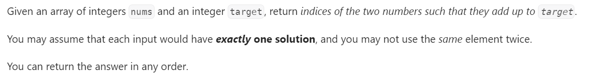
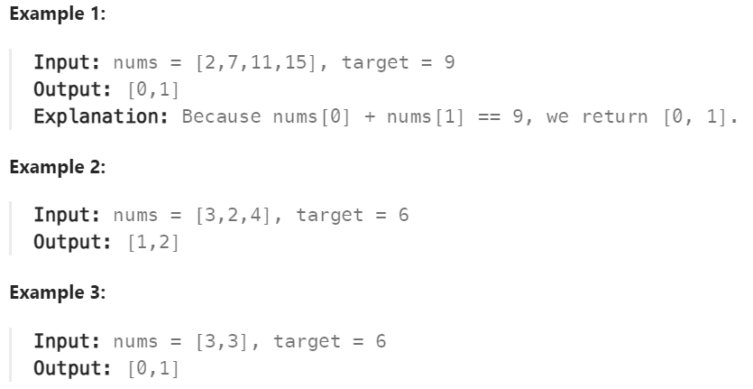
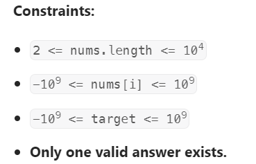
 

### Approach : One-pass Hash Table
### Algorithm

It turns out we can do it in one-pass. While we are iterating and inserting elements into the hash table, we also look back to check if current element's complement already exists in the hash table. If it exists, we have found a solution and return the indices immediately.

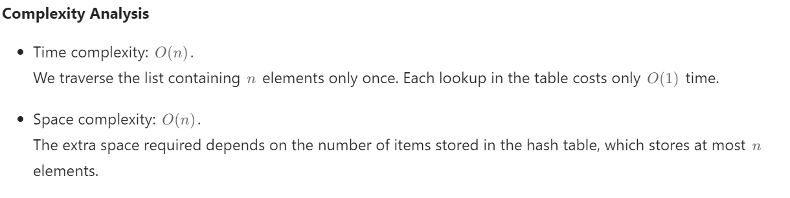

# Two Sum II - Input Array is Sorted

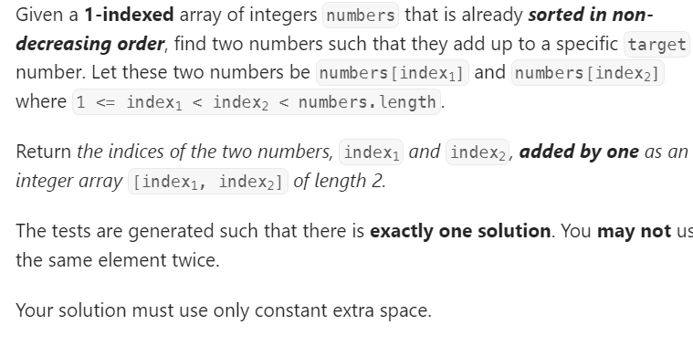

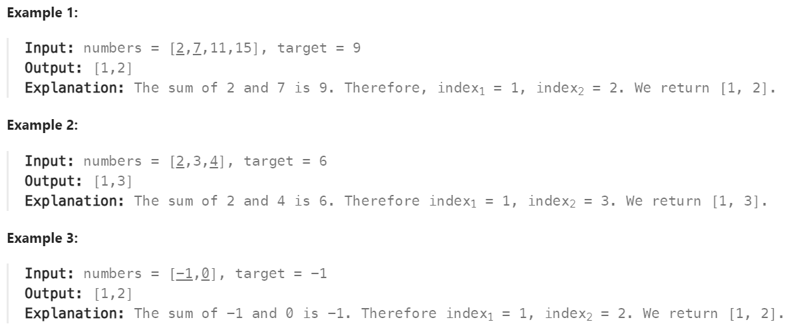
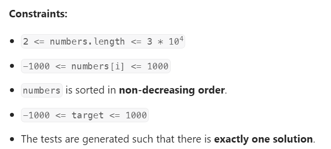
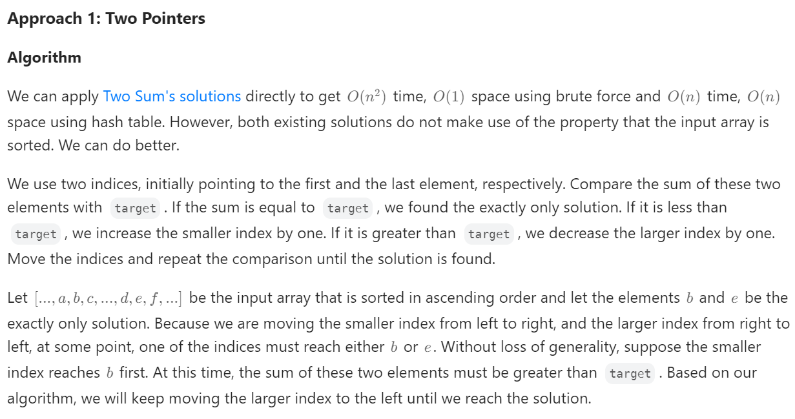
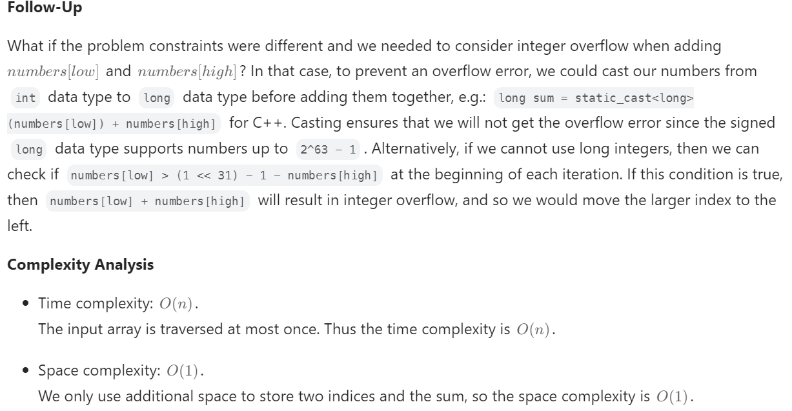

# 3Sum
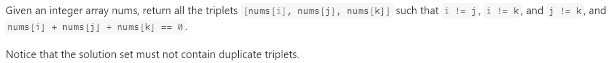

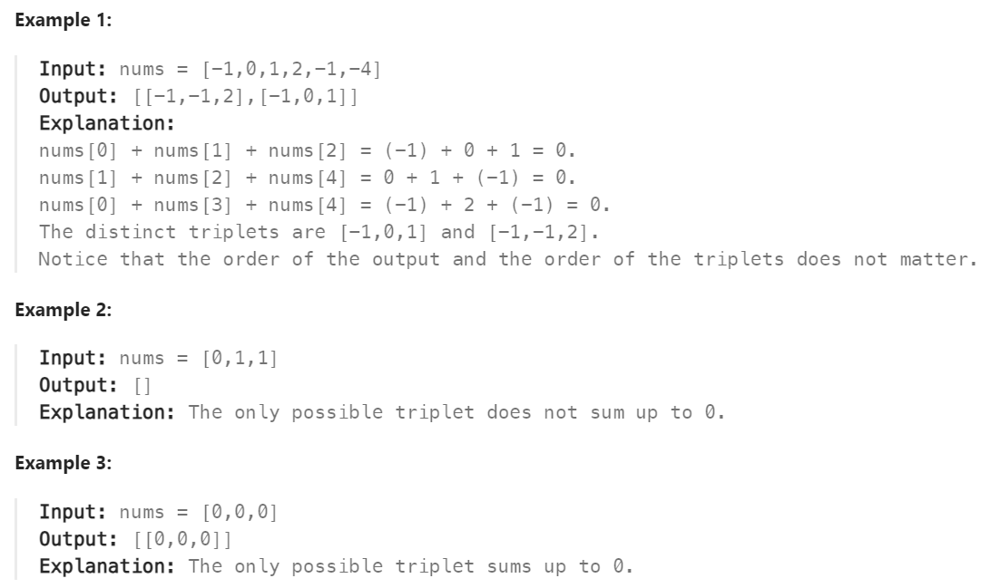
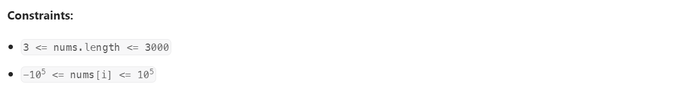

### Solution 

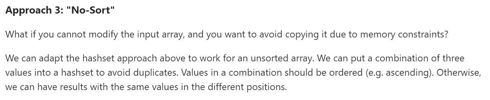
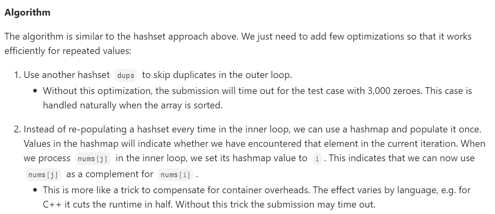

